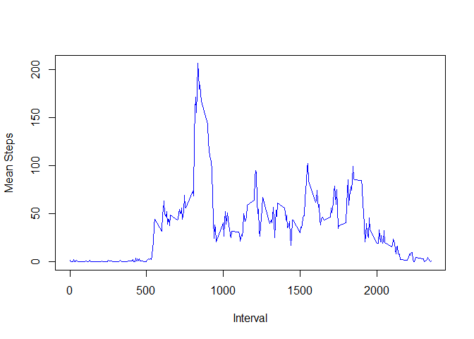

# Reproducible Research: Peer Assessment 1


## Loading and preprocessing the data
 
<br>
 
####First we will change our directory to the RepData_PeerAssessment1 folder
####and load in the *activity.csv* file in the **activity** folder.

<br>

```r
setwd("C:/Users/Zachary/Data Science/Reproducible Data/RepData_PeerAssessment1")
Dat <- read.csv("./activity/activity.csv")
```
<br>

####Let's take a look at the summary of our data:
<br>

```r
summary(Dat)
```

```
##      steps                date          interval     
##  Min.   :  0.00   2012-10-01:  288   Min.   :   0.0  
##  1st Qu.:  0.00   2012-10-02:  288   1st Qu.: 588.8  
##  Median :  0.00   2012-10-03:  288   Median :1177.5  
##  Mean   : 37.38   2012-10-04:  288   Mean   :1177.5  
##  3rd Qu.: 12.00   2012-10-05:  288   3rd Qu.:1766.2  
##  Max.   :806.00   2012-10-06:  288   Max.   :2355.0  
##  NA's   :2304     (Other)   :15840
```
<br>

####and a str, too:
<br>

```r
str(Dat)
```

```
## 'data.frame':	17568 obs. of  3 variables:
##  $ steps   : int  NA NA NA NA NA NA NA NA NA NA ...
##  $ date    : Factor w/ 61 levels "2012-10-01","2012-10-02",..: 1 1 1 1 1 1 1 1 1 1 ...
##  $ interval: int  0 5 10 15 20 25 30 35 40 45 ...
```
<br>

#### So it appears we have three variables: 
<br>
*steps* which is an integer, but has some missing values.    
*date* which is a factor consisting of 61 unique dates in the form YYYY-MM-DD with 288 observations each.  
*interval* which is an integer increasing by 5 for each observation, up to a max of 2355 per day. These values are essentially military times (i.e 1300 = 1:00 PM).

<br>

#### Let's move on.
<br>

## What is mean total number of steps taken per day?
<br>


####First we'll make a histogram of total number of steps per day for each date in the Dataset. To do this, we'll have to create a summarized data frame using plyr. Our new column is called $sum.
<br>

```r
library(plyr)
MeanSteps <- ddply(Dat,.(date),summarise,sum=sum(steps))
```
<br>

####We should add assign each day an integer 1 to 61 so that our x-axis isn't cluttered with dates. We'll also remove days with NA values.
<br>

```r
MeanSteps$day <- seq(1:61)
MeanSteps <- na.omit(MeanSteps)
```
<br>

####Then let's make a histogram with qplot.
<br>

```r
library(ggplot2)
q <- qplot(day,sum,data=MeanSteps,ylab="Total Steps",xlab="Day")
print(q)
```

 
<br>

####Calculating the **mean** and **median** steps is easy from here.
<br>

```r
mean(MeanSteps$sum)
```

```
## [1] 10766.19
```
<br>

```r
median(MeanSteps$sum)
```

```
## [1] 10765
```
<br>


## What is the average daily activity pattern?
<br>

####We'll take a similar approach as we did before, except now we'll use ddply with the interval column so that interval is our x-axis. Note now we're summarising on **mean** instead of **sum**.
<br>


```r
MeanIntervals <- ddply(Dat,.(interval),summarise,mean=mean(steps,na.rm=TRUE))
IntervalPlot <- plot(MeanIntervals$interval,MeanIntervals$mean,type="l",xlab="Interval",ylab="Mean Steps",col="4")
```

 
<br>

####The second part asks us to find the interval where number of steps is highest across all days. We'll use the MeanIntervals data frame and subset for the max mean step value.
<br>


```r
subset(MeanIntervals,MeanIntervals$mean==max(MeanIntervals$mean))
```

```
##     interval     mean
## 104      835 206.1698
```
<br>

####So our 5-minute interval with the highest step mean is **835** or **8:35 AM** to **8:40 AM**.
<br>

## Imputing missing values
<br>

####To calculate the number of missing values in *Dat*, we can just subset to NA values:
<br>


```r
justNA <- Dat[is.na(Dat),]
dim(justNA)
```

```
## [1] 2304    3
```
<br>

####A total of **2304** values. It also appears that the NA values belong to eight specific dates where all steps for those days are NA. The assignment asks us to replace those NA values with real values, so let's replace all of those days' step values with the mean step values for each interval across the entire non-NA dataset.
<br>

####We already have an existing data frame called *MeanIntervals* where we calculated mean step for each interval. We'll use this frame to overwrite the *justNA* table we made in the earlier step. The *rep* function will repeat the list 8 times because there are eight days we need to overwrite.
<br>


```r
justNA$steps <- rep(MeanIntervals$mean,times=8)
```
<br>

####Let's use the merge function to merge *Dat* and *justNA* to create *NewDat*. We can now remove NA values again, and we should be left with all non-NA values.
<br>


```r
NewDat <- merge(Dat,justNA,all.x=TRUE,all.y=TRUE)
NewDat <- na.omit(NewDat)
```
<br>

####We'll now repeat the steps we did earlier in the assignment to find the mean and median total number of steps taken per day.
<br>


```r
MeanStepsNew <- ddply(NewDat,.(date),summarise,sum=sum(steps))
MeanStepsNew$day <- seq(1:61)
qNew <- qplot(day,sum,data=MeanStepsNew,ylab="Total Steps",xlab="Day")
print(qNew)
```

 
<br>


```r
mean(MeanStepsNew$sum)
```

```
## [1] 10766.19
```
<br>

```r
median(MeanStepsNew$sum)
```

```
## [1] 10766.19
```
<br>

####It turns out, our new median and mean are equal! This is not so surprising, considering 8 days out of 61 have identical values (10766.19) which is the average and median value of the data set. By swapping out the NA values for mean values, we basically made the dataset more tightly symmetrical around the median value.
<br>

## Are there differences in activity patterns between weekdays and weekends?
<br>

####First we'll add a factor variable *daytype* to NewDat. Before we can do that, we'll convert *date* from a factor variable to a date, then use *weekdays()* to turn those days into characters, and finally *factor()* to create our factors. Let's go!
<br>

```r
NewDat$date <- as.Date(NewDat$date,"%Y-%m-%d")
NewDat$date <- weekdays(NewDat$date)
NewDat$daytype <- factor(NewDat$date)
levels(NewDat$daytype) <- list(Weekday=c("Monday","Tuesday","Wednesday","Thursday","Friday"),Weekend=c("Saturday","Sunday"))
str(NewDat$daytype)
```

```
##  Factor w/ 2 levels "Weekday","Weekend": 1 1 1 1 1 1 1 1 1 1 ...
```
<br>

####Now let's make our plot. But before we can, we'll use ddply twice to summarize the mean steps data for both weekday and weekends, and then we'll rbind those tables to create one table with the summaries for both weekends and weekdays. This final table will be called **AllIntervalMeans**.
<br>


```r
WkndMeanIntervals <- ddply(subset(NewDat,NewDat$daytype=="Weekend"),.(interval),summarise,mean=mean(steps,na.rm=TRUE))
WkndMeanIntervals$type <- factor("Weekend")
WkdayMeanIntervals <- ddply(subset(NewDat,NewDat$daytype=="Weekday"),.(interval),summarise,mean=mean(steps,na.rm=TRUE))
WkdayMeanIntervals$type <- factor("Weekday")
AllIntervalMeans <- rbind(WkndMeanIntervals,WkdayMeanIntervals)
```
<br>

####Now let's make a lattice graph and be done!
<br>


```r
library(lattice)
xyplot(AllIntervalMeans$mean ~ AllIntervalMeans$interval | AllIntervalMeans$type,AllIntervalMeans,type="l",layout=c(1,2),xlab="Interval",ylab="Number of Steps")
```

 
<br>

####Comparing these graphs, a lot of things make sense. It appears subjects aren't as active in the mornings on weekends (they are probably sleeping in!) and are more active between 9:30AM and 4:00 PM than during the week (not at work so probably not sitting down).


